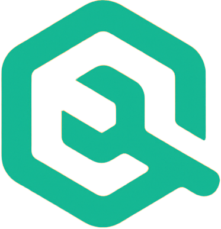

<p align="center">
  
</p>

<p align="center">
  <a href="https://readme-typing-svg.demolab.com">
    
  </a>
</p>

<p align="center">
  
  <a href="https://github.com/tranquanghuy7198">
    
  </a>
</p>

<h2 align="center">⚙️ src/pages/AboutMe.tsx ⚙️</h2>

```typescript
const huy: Engineer = {
  name: "Quang-Huy Tran",
  role: "Fullstack Engineer | Web3 Builder",
  location: "Hanoi, Vietnam 🇻🇳",
  experience: "8+ years",
  passion:
    "Designing and shipping end-to-end systems from smart contracts to data pipelines",
  building: [
    "Decentralized applications",
    "Distributed indexing services",
    "Cross-chain infrastructure",
  ],
  ecosystems: ["EVM", "Solana", "Cosmos"],
  stack: [
    "Golang · Node.js · Python · GraphQL · REST",
    "Solidity · Rust (Anchor) · CosmWasm",
    "PostgreSQL · MongoDB · Redis · BigQuery",
    "GCP · Docker · Pub/Sub · Dagster · Airflow",
  ],
  open_to: ["Full-time", "Blockchains"],
  motto: "Ship on-chain. Scale off-chain. Repeat.",
};
```

<h2 align="center">⚙️ src/pages/Projects.tsx ⚙️</h2>

<div>
  
  <a href="https://nocturnal.xyz"><b>Nocturnal</b></a><br/>
  <sub>Solana meme trading platform</sub>
</div>
<br clear="left"/>

<div>
  
  <a href="https://opensea.io/collection/weallsurviveddeath"><b>We All Survived Death</b></a><br/>
  <sub>Ethereum WASD collection, 10k sold out</sub>
</div>
<br clear="left"/>

<div>
  
  <a href="https://kontraxhub.xyz"><b>KontraxHub</b></a><br/>
  <sub>Multi-chain smart contract deployment & interaction platform</sub>
</div>
<br clear="left"/>

<h2 align="center">⚙️ src/pages/TechStack.tsx ⚙️</h2>

<table align="center">
  <tr>
    <td align="center"><br>Solidity</td>
    <td align="center"><br>Rust</td>
    <td align="center"><br>Golang</td>
    <td align="center"><br>Python</td>
    <td align="center"><br>Node.js</td>
    <td align="center"><br>TypeScript</td>
    <td align="center"><br>JavaScript</td>
    <td align="center"><br>Git</td>
  </tr>
  <tr>
    <td align="center"><br>React</td>
    <td align="center"><br>GraphQL</td>
    <td align="center"><br>WebSocket</td>
    <td align="center"><br>PostgreSQL</td>
    <td align="center"><br>MongoDB</td>
    <td align="center"><br>Redis</td>
    <td align="center"><br>Docker</td>
    <td align="center"><br>GCP</td>
  </tr>
  <tr>
    <td align="center"><br>EVM</td>
    <td align="center"><br>Solana</td>
    <td align="center"><br>Pub/Sub</td>
    <td align="center"><br>Airflow</td>
    <td align="center"><br>BigQuery</td>
    <td align="center"><br>IPFS</td>
    <td align="center"><br>Vue.js</td>
    <td align="center"><br>Hardhat</td>
  </tr>
</table>

<h2 align="center">⚙️ src/pages/OnMyRadar.tsx ⚙️</h2>

<table align="center">
  <tr>
    <td>⛓️ Cross-chain Interoperability</td>
    <td>🤖 AI x Web3 Automation</td>
    <td>📊 On-chain Analytics</td>
  </tr>
  <tr>
    <td>🧱 ZK Proofs & Layer 2 Scaling</td>
    <td>🔍 MEV & DeFi Infrastructure</td>
    <td>🌐 Decentralized Data Pipelines</td>
  </tr>
  <tr>
    <td>🚀 High-throughput Indexing</td>
    <td>🔗 Distributed Systems Design</td>
    <td>🐳 Containerized Microservices</td>
  </tr>
</table>

<h2 align="center">⚙️ src/pages/Stats.tsx ⚙️</h2>

<div align="center">
  <table>
    <tr>
      <td align="center">
        
      </td>
      <td align="center">
        
      </td>
    </tr>
  </table>
</div>

<h2 align="center">⚙️ src/pages/Contributions.tsx ⚙️</h2>

<p align="center">
  <picture>
    <source media="(prefers-color-scheme: dark)" srcset="https://raw.githubusercontent.com/tranquanghuy7198/tranquanghuy7198/output/github-snake-dark.svg">
    <source media="(prefers-color-scheme: light)" srcset="https://raw.githubusercontent.com/tranquanghuy7198/tranquanghuy7198/output/github-snake.svg">
    
  </picture>
</p>

<h2 align="center">⚙️ src/pages/WhoAmI.tsx ⚙️</h2>

```bash
~/huy $ cat about.sh

NAME="Quang-Huy Tran"
LOCATION="Hanoi, Vietnam 🇻🇳"
EDUCATION="Hanoi University of Science and Technology — Excellent, CPA 3.71/4"

INTERESTS=("⛓️ Blockchain" "📐 System Design" "📈 Data Engineering")

FACTS=(
  "🌙 Production bugs hit hardest at 2am — so I monitor at 2am"
  "🔍 50M+ on-chain events indexed, still counting"
  "🚀 If it's not deployed, it doesn't exist"
)
```

<h2 align="center">⚙️ src/pages/Quote.tsx ⚙️</h2>

<p align="center">
  <em><strong>"The best smart contract is the one that never needs upgrading — but I always write the upgrade path anyway."</strong></em>
</p>

<h2 align="center">⚙️ src/pages/ContactMe.tsx ⚙️</h2>

<p align="center">
  <a href="mailto:tranquanghuy7198@gmail.com">
    
  </a>
  <a href="https://www.linkedin.com/in/tranquanghuy7198">
    
  </a>
  <a href="https://github.com/tranquanghuy7198">
    
  </a>
</p>
